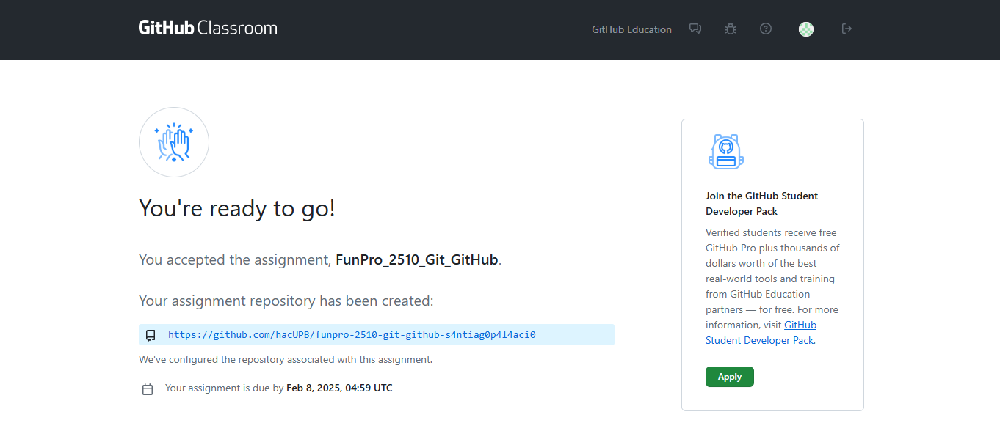
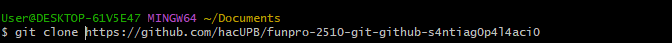
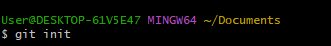

[](https://classroom.github.com/a/WV8VkdWq)
# Bitácora
Nombre del estudiante:  Santiago Palacio Vargas
Id.: 000575805
----

    Descripción del proyecto

Este es un proyecto que busca la exploración de repositorios de git, tanto en forma local como remota. El objetivo de este proyecto era clonar un repositorio remoto, para localmente editarlo e ir sincronizando los cambios.Hay imágenes, archivos markdown y un archivo c.

    ¿Que hay adentro?

[funpro-2510-git-github-s4ntiag0p4l4aci0
](.)

- [README.md](README.md)

- [docs](./docs)

    - [Uso de la consola](./docs/uso_consola.md)
    - [Repositorio local](.//repositorio_local.md)
    - [Repositorio remoto](./docs/repositorio_remoto.md)

- [images](./images/)
    - [img1](./images/Img1.png)
    - [img2](./images/Img2.png)
    - [img3](./images/img3.png)
    - [img4](./images/img4.png)
    - [img5](./images/img5.png)

    - [imga](./images/imga.png)
    - [imgb](./images/imgb.png)
    - [imgc](./images/imgc.png)
    - [imgd](./images/imgd.png)
    - [imgd1](./images/imgd1.png)
    - [imgd2](./images/imgd2.png)
    - [imge](./images/imge.png)
    - [imgf](./images/IMGF.png)
    - [imgf1](./images/imgf1.png)
    - [imgf2](./images/imgf2.png)
    - [imgf3](./images/imgf3.png)
    - [imgg](./images/imgg.png)
    - [imgh](./images/imgh.png)
    - [imgi](./images/imgi.png)


- [src](./src/)
    - [script.c](./src/script.c)

- [.gitignore](.gitignore)


---
    ¿Cómo se clonó? / ¿Cómo clonar?

se copió el link generado en la evaluación de acuerdo al id


con 

``` 
git clone https://github.com/hacUPB/funpro-2510-git-github-s4ntiag0p4l4aci0

```
se clona el repositorio remoto de forma local en el computador




Se ejecuta el repositorio con

```
git init
```


