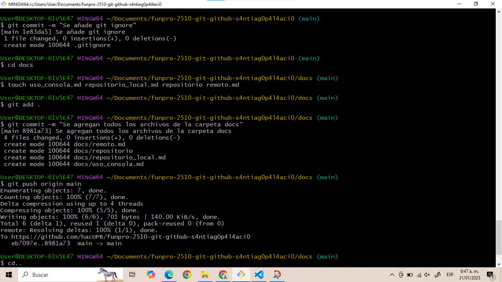
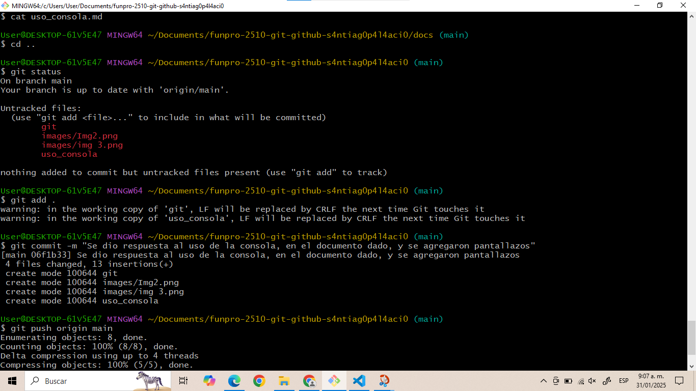

```
 __ __  _____  _____    _____  _____  _____  _____  _____  ____   _____ 
/  |  \/  ___>/  _  \  /     \/  _  \/  _  \/  ___>/  _  \/  _/  /  _  \
|  |  ||___  ||  |  |  |  |--||  |  ||  |  ||___  ||  |  ||  |---|  _  |
\_____/<_____/\_____/  \_____/\_____/\__|__/<_____/\_____/\_____/\__|__/

```                                                                                                  
La consola de git bash, es en parte similar al CMD de Windows, ambos nos permiten tomar acciones sobre archivos u otras aplicacíones por medio de comandos. Nos permite controlar el sistema, dado que permite la creación, modificación y remoción de archivos desde diferentes tipos extensiones y tamaños. Es muy práctivo, pues es como un cuartel general donde se supervisan y se llevan a cabo diferentes acciones. Es mucho más práctico hacer gestiones desde la consola que estar abriendo aplicaciones exclusivamente para la gestión de archivos.

Es muy práctica para el control de versiones, ya que nos permite generar y guardar los procesos sin importar cuantos cambios se hayan hecho, es decir, se puede hacer un commit para uno, dos o más archivos. Te permite guardar los cambios que quieres en el momento que necesites. En adición la visualización de los archivos desde la misma consola con el cat, nos presentan un panorama general de los cambios hechos. Adicionalmente, siempre y cuando no se use el remove, es fácil y factible arreglar los errores cometidos.

    Imágenes

Unas imágenes de diferentes usos de la consola





